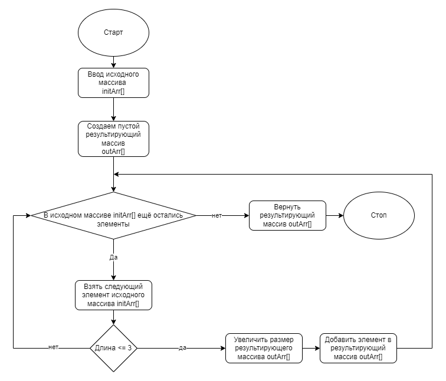

# Контрольная работа

 > *Данная программа, из имеющегося массива строк формирует новый массив из строк, длина которых меньше, либо равна 3 символам. Первоначальный массив вводится пользователем с клавиатуры.*

 # Блок-схема

